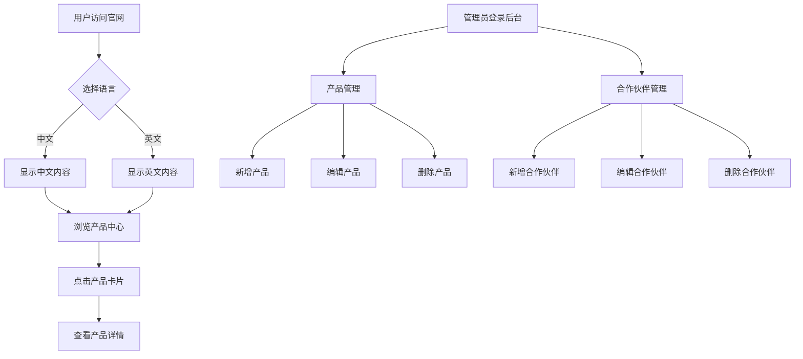

# 惠州源医官网升级需求文档

## 1. 产品概述

- 惠州市源医科技有限公司官网升级项目，在现有单页面网站基础上增加中英双语切换功能，优化视觉设计为冷色系风格，并实现产品中心与合作伙伴模块的可视化内容管理功能。
- 目标用户为企业客户、合作伙伴及潜在投资者，提升国际化形象与内容管理效率。

## 2. 核心功能

### 2.1 用户角色

| 角色 | 访问方式 | 核心权限 |
|------|----------|----------|
| 普通访客 | 直接访问 | 浏览官网内容、切换语言 |
| 内容管理员 | 后台入口 | 增删改产品信息、合作伙伴信息 |

### 2.2 功能模块

1. **语言切换模块**：顶部导航栏语言切换按钮，支持中英文实时切换
2. **产品中心管理模块**：产品卡片展示、产品详情弹窗、后台管理界面（增删改）
3. **合作伙伴管理模块**：合作伙伴展示、超链接跳转、后台管理界面（增删改）
4. **视觉优化模块**：冷色系背景主题、现代化设计风格

### 2.3 页面详情

| 页面名称 | 模块名称 | 功能描述 |
|----------|----------|----------|
| 首页 | 语言切换器 | 顶部导航栏右侧显示语言切换按钮，点击切换中/英文 |
| 首页 | 产品中心 | 产品卡片网格展示，支持分类筛选，点击查看详情 |
| 首页 | 合作伙伴 | 合作伙伴Logo网格展示，点击跳转外部链接 |
| 管理后台 | 产品管理 | 产品列表、新增/编辑/删除产品表单、图片上传 |
| 管理后台 | 合作伙伴管理 | 合作伙伴列表、新增/编辑/删除表单、图标/链接配置 |

## 3. 核心流程

### 3.1 语言切换流程

用户访问官网 → 默认显示中文 → 点击语言切换按钮 → 页面内容切换为英文 → 再次点击切换回中文

### 3.2 产品管理流程

管理员进入后台 → 点击产品管理 → 查看产品列表 → 点击新增/编辑 → 填写产品信息并上传图片 → 保存 → 前台实时更新显示

### 3.3 流程图

## 4. 用户界面设计

### 4.1 设计风格

- **主色调**：冷色系（深蓝 #1e3a5f、科技蓝 #0ea5e9、青色 #06b6d4）
- **辅助色**：白色、浅灰、深灰
- **按钮风格**：圆角矩形、渐变背景、悬停动效
- **字体**：思源黑体 / Inter（英文）、16px正文、24px标题
- **布局风格**：卡片式布局、顶部固定导航、响应式设计
- **图标风格**：线性图标、统一风格

### 4.2 页面设计概览

| 页面名称 | 模块名称 | UI元素 |
|----------|----------|--------|
| 首页 | Hero区域 | 冷色渐变背景、动态光效、大标题、CTA按钮 |
| 首页 | 导航栏 | 固定顶部、Logo、导航链接、语言切换按钮 |
| 首页 | 产品中心 | 产品卡片网格、分类筛选标签、产品详情弹窗 |
| 首页 | 合作伙伴 | Logo网格布局、悬停效果、外部链接 |
| 管理后台 | 侧边栏 | 导航菜单、模块入口 |
| 管理后台 | 内容列表 | 表格展示、操作按钮、分页 |
| 管理后台 | 编辑表单 | 表单字段、图片上传预览、保存取消按钮 |

### 4.3 响应式设计

- 桌面优先设计，适配1920px、1440px、1280px
- 平板适配：768px-1024px，导航折叠为汉堡菜单
- 移动端适配：375px-768px，单列布局，触摸优化

### 4.4 动效设计

- 页面滚动：渐入动画（fade-in）
- 卡片悬停：上浮阴影效果
- 按钮悬停：颜色渐变、缩放效果
- 语言切换：平滑过渡动画
- 弹窗：缩放淡入效果
