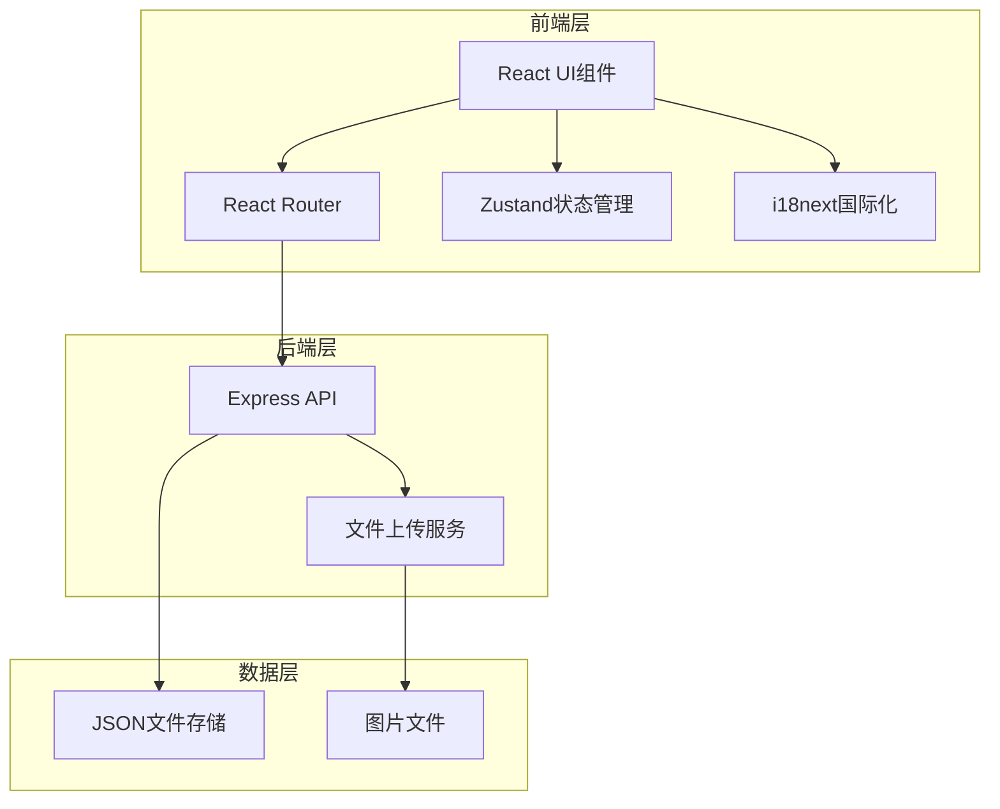
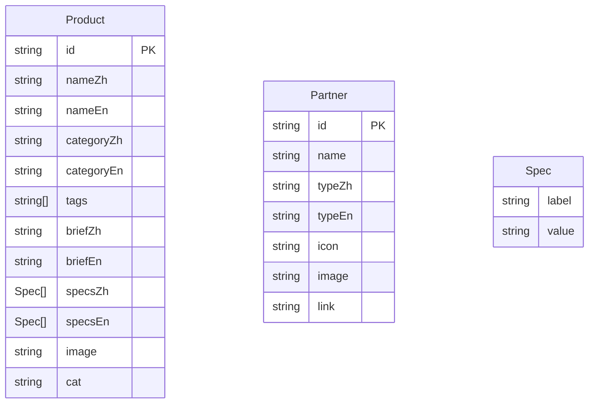

# 惠州源医官网技术架构文档

## 1. 架构设计



## 2. 技术说明

- **前端**：React@18 + TypeScript + Tailwind CSS@3 + Vite
- **初始化工具**：vite-init (react-ts模板)
- **后端**：Express@4 + TypeScript
- **数据库**：JSON文件存储（轻量级方案，便于维护）
- **国际化**：i18next + react-i18next
- **状态管理**：Zustand
- **路由**：react-router-dom

## 3. 路由定义

| 路由 | 用途 |
|------|------|
| `/` | 首页（官网主体） |
| `/admin` | 管理后台首页 |
| `/admin/products` | 产品管理页面 |
| `/admin/partners` | 合作伙伴管理页面 |

## 4. API定义

### 4.1 产品相关API

```typescript
// 获取产品列表
GET /api/products
Response: Product[]

// 获取单个产品
GET /api/products/:id
Response: Product

// 新增产品
POST /api/products
Body: Omit<Product, 'id'>
Response: Product

// 更新产品
PUT /api/products/:id
Body: Partial<Product>
Response: Product

// 删除产品
DELETE /api/products/:id
Response: { success: boolean }
```

### 4.2 合作伙伴相关API

```typescript
// 获取合作伙伴列表
GET /api/partners
Response: Partner[]

// 新增合作伙伴
POST /api/partners
Body: Omit<Partner, 'id'>
Response: Partner

// 更新合作伙伴
PUT /api/partners/:id
Body: Partial<Partner>
Response: Partner

// 删除合作伙伴
DELETE /api/partners/:id
Response: { success: boolean }
```

### 4.3 文件上传API

```typescript
// 上传图片
POST /api/upload
Body: FormData (file)
Response: { url: string, filename: string }
```

## 5. 数据模型

### 5.1 数据模型定义



### 5.2 TypeScript类型定义

```typescript
interface Product {
  id: string;
  nameZh: string;
  nameEn: string;
  categoryZh: string;
  categoryEn: string;
  tags: string[];
  briefZh: string;
  briefEn: string;
  specsZh: { label: string; value: string }[];
  specsEn: { label: string; value: string }[];
  image: string;
  cat: 'comm' | 'medical' | 'iot';
}

interface Partner {
  id: string;
  name: string;
  typeZh: string;
  typeEn: string;
  icon: string;
  image: string;
  link: string;
}
```

## 6. 项目结构

```
源医1.0/
├── src/
│   ├── components/          # 公共组件
│   │   ├── Navigation.tsx   # 导航栏（含语言切换）
│   │   ├── Hero.tsx         # Hero区域
│   │   ├── ProductCard.tsx  # 产品卡片
│   │   ├── ProductModal.tsx # 产品详情弹窗
│   │   ├── PartnerCard.tsx  # 合作伙伴卡片
│   │   └── ...
│   ├── pages/
│   │   ├── Home.tsx         # 首页
│   │   ├── AdminLayout.tsx  # 后台布局
│   │   ├── ProductAdmin.tsx # 产品管理
│   │   └── PartnerAdmin.tsx # 合作伙伴管理
│   ├── hooks/
│   │   └── useLanguage.ts   # 语言切换Hook
│   ├── i18n/
│   │   ├── index.ts         # i18n配置
│   │   ├── zh.json          # 中文翻译
│   │   └── en.json          # 英文翻译
│   ├── store/
│   │   └── useStore.ts      # Zustand状态管理
│   ├── types/
│   │   └── index.ts         # TypeScript类型定义
│   └── utils/
│       └── api.ts           # API请求工具
├── api/
│   ├── routes/
│   │   ├── products.ts      # 产品API路由
│   │   ├── partners.ts      # 合作伙伴API路由
│   │   └── upload.ts        # 文件上传路由
│   ├── data/
│   │   ├── products.json    # 产品数据
│   │   └── partners.json    # 合作伙伴数据
│   └── index.ts             # Express入口
├── public/
│   └── uploads/             # 上传图片存储
├── images/                  # 现有图片资源
└── ...
```

## 7. 冷色系设计规范

### 7.1 色彩变量

```css
:root {
  --primary-dark: #1e3a5f;    /* 深蓝 */
  --primary: #0ea5e9;         /* 科技蓝 */
  --primary-light: #38bdf8;   /* 浅蓝 */
  --accent: #06b6d4;          /* 青色 */
  --accent-light: #22d3ee;    /* 浅青 */
  --bg-dark: #0f172a;         /* 深色背景 */
  --bg-medium: #1e293b;       /* 中等背景 */
  --bg-light: #f0f9ff;        /* 浅色背景 */
  --text-primary: #f8fafc;    /* 主文字（深色背景） */
  --text-secondary: #94a3b8;  /* 次要文字 */
}
```

### 7.2 背景渐变

```css
/* Hero区域背景 */
background: linear-gradient(135deg, #0f172a 0%, #1e3a5f 50%, #0c4a6e 100%);

/* 区域背景 */
background: linear-gradient(180deg, #f0f9ff 0%, #e0f2fe 100%);
```
